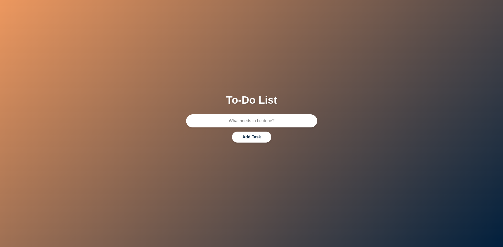

# 📝 Modern To-Do List

A sleek and modern to-do list application built with vanilla JavaScript, featuring smooth animations and a beautiful gradient interface.

## ✨ Features

- ✅ Add tasks with a single click or Enter key
- 🗑️ Delete tasks with smooth animations
- 🎨 Modern gradient UI design
- 📱 Fully responsive layout
- ⚡ Smooth slide-in/slide-out animations
- 🎯 Clean and intuitive interface

## 🚀 Demo

[Live Demo](#) https://c-panagopoulos.github.io/vanilla-js-todo-app/

## 🛠️ Built With

- **HTML5** - Structure and markup
- **CSS3** - Styling and animations
- **JavaScript (ES6)** - Functionality and interactivity

## 📋 How It Works

1. Enter your task in the input field
2. Click "Add Task" or press Enter
3. Your task appears in the list below
4. Click the ✕ button to remove completed tasks

## 🎯 Learning Journey

This project was built as part of my web development learning journey. The reason I wanted to create it, was to understand JavaScript DOM manipulation concepts, which helped me grasp:

- Event listeners and event handling
- DOM element creation and manipulation
- Dynamic content rendering
- CSS animations and transitions

## 🔮 Future Enhancements

- [ ] **Local Storage Implementation** - Save tasks so they persist after page refresh
- [ ] Edit task functionality
- [ ] Mark tasks as complete
- [ ] Filter tasks (All, Active, Completed)
- [ ] Task categories/tags
- [ ] Dark/Light theme toggle
- [ ] Due dates for tasks
- [ ] Priority levels

## 📝 License

This project is open source and available under the [MIT License](LICENSE).

## 👤 Author

Charalampos Panagopoulos

🔗 [Portfolio](https://c-panagopoulos.github.io/Personal-Website/)  
🔗 [GitHub](https://github.com/c-panagopoulos)  
🔗 [LinkedIn](https://linkedin.com/in/c-panagopoulos)

## 🙏 Acknowledgments

- Inspired by modern todo list applications
- Thanks to the web development community for inspiration

---

⭐ If you found this project helpful, please consider giving it a star!
